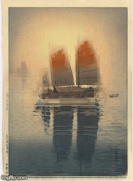
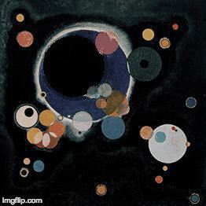
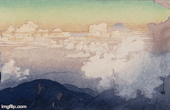

# Animating Pictures with Motion Textures

An implementation of "Animating Pictures with Stochastic Motion Textures" by Yung-Yu Chuang et. al. 2005, completed for UC Berkeley's Computation Photography course (CS194-26) in Fall 2018. 

## Steps and Usage

1. Segmentation - Trimaps are already generated, via Photoshop or similar tool.
2. Matting - `python3 matting.py [input image] [trimap] [output dir]`
3. Inpainting - `python3 inpainting.py [input image to fill in] [mask] [output dir]`
4. Rendering - `python3 motion.py [motion specification text file]`

## Some Results

### The Boat Studio by Claude Monet, 1876

### Sailing Boats Morning by Yoshida Hiroshi, 1926

### Several Circles by Wassily Kandinsky, 1926

### Above the Clouds by Yoshida Hiroshi, 1929

### Duck Pond

[Source](https://community.glwb.net/gallery/index.php/Lorain-County-Summer-Photos/Duck-Pond-Fall-4)

### Sunflowers

[Source](https://www.readingeagle.com/news/article/elverson-sunflower-field-a-sunny-spot-in-a-sometimes-dark-world)

